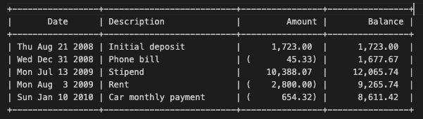

# Bank_Statement_Formatter_DoublyLInked_Circular_List
 
**Synopsis**:
This is an implementation for a doubly-linked circular list (my402list.c, my402list.h). It will be used as the representation for a list of transactions (or transaction objects). Moreover, the warmup1.c file is a program that will process a file of unsorted transaction records and produce a sorted transaction history with computed balances. For example, given contents in test.tfile, it will produce the following:

- To compile the program, use the command: make warmup1
- To run the program, use the command: ./warmup1 sort test.tfile
